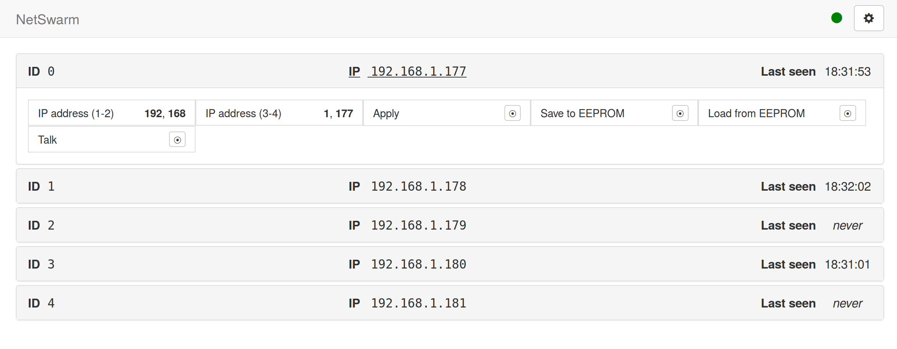

# NetSwarm webapp

Web application for monitoring and debugging a network of Arduinos based on
[NetSwarm](https://github.com/wvengen/netswarm-arduino).

**In progress, not ready for use yet.**




## Install

You need to have [Python](https://python.org/). Requirements are listed
in [requirements.txt](requirements.txt) and can be installed directly
either by running:

```sh
pip install -r requirements.txt
```

or, if you are on [Debian](http://debian.org/) (or a derivative like
[Ubuntu](http://ubuntu.com/)):

```sh
sudo apt-get install python-twisted-web python-socketio python-pymodbus
```

After that, you can start the webserver

```
python app.py
```

Then visit [http://localhost:5000/](http://localhost:5000).


## Configure

Configuration is stored by the server in the file `config.json` (which is
created if it doesn't exist when it is saved). Most settings can be changed
in the configuration dialog.

At the moment, it is not yet possible to configure the registers. For now,
this can be done manually in the JSON-file, in the `registers` key. This
hash has modbus register addresses as keys, and a register descriptor as
value, describing how the register will be displayed and used.

A register with address 100 could like the following:

```json
{
  "...": "etc.",
  "registers": {
    "100": {
      "type": "hreg",
      "format": "hex",
      "bits": 16,
      "label": "Event count"
    }
  }
}
```

This would indicate that the node has only one holding register, having the
address 100. It will be displayed as a hexadecimal number, 16-bit wide, and
labeled _Event count_.

Other numeric formats are `dec`, `oct`. To show a checkbox or button (typically
a coil, as it can be only on or off), use `bool`, `btn` or `cmdbtn` (which is a
button that will be reset right after being pressed, used for giving commands).
If the register contains a character, use `char`.

When you use a single register (which is always 16 bits wide) to hold multiple
values (e.g., the first two bytes of an IP-address), set `bits` to one of `1`,
`2`, `4` or `8` (or `16`) to show the values separately. E.g.

```json
{
  "...": "...",
  "registers": {
    "100": {
      "type": "hreg",
      "format": "dec",
      "bits": 8,
      "label": "IP address (1-2)"
    }
  }
}
```

will show a value of _49320_ as _192, 168_.
